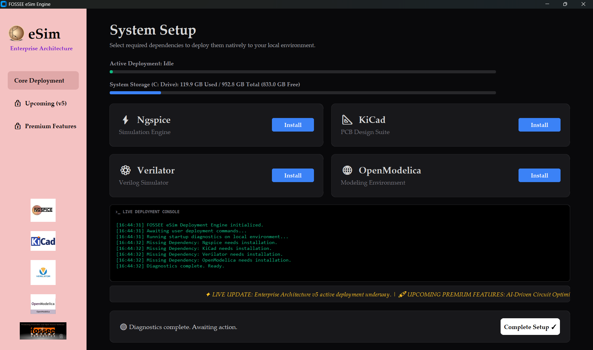
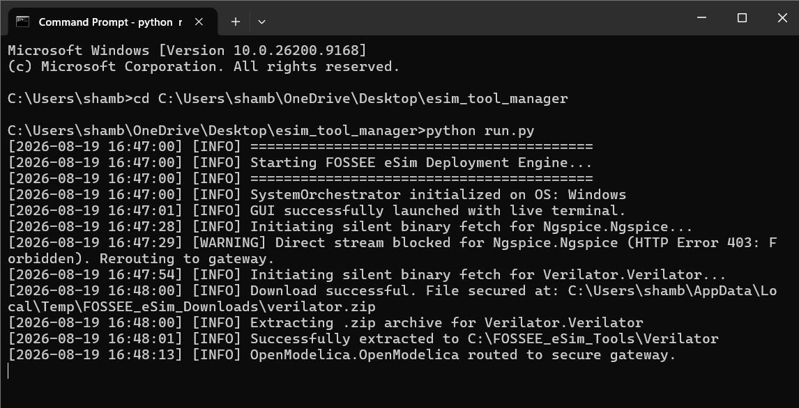

# ⚡ eSim Unified Tool Manager

> A smart, OS-aware GUI application designed to make eSim dependency management seamless and intuitive for every user.


 


## <font color="#2563eb">**📌 Overview**</font>

The eSim Unified Tool Manager is a Python-based graphical application purpose-built for the FOSSEE ecosystem. Its primary goal is to completely automate the installation, management, and monitoring of external tools required for the eSim Electronic Design Automation (EDA) environment.

By replacing complex terminal commands with a clean, centralized, and multi-threaded interface, this tool ensures that students, educators, and electronics enthusiasts can focus entirely on circuit design rather than fighting with software setups.

---

## <font color="#2563eb">**❗ Problem Statement & My Approach**</font>

Setting up the eSim environment natively requires managing multiple external tools (Ngspice, KiCad, Verilator) with vastly different payload architectures. 

Historically, manual installation has been:
- **Intimidating for beginners:** Command-line setups often deter non-CS students from using EDA tools.
- **Error-prone:** Incorrect environment paths or missing dependencies break the software.
- **Fragmented:** Different operating systems (Windows, macOS, Linux) require entirely different setup instructions.

**My Approach:** I wanted to build a solution that didn't just "work," but felt intuitive. I engineered this tool to handle the heavy lifting asynchronously in the background. It automatically detects the user's operating system, calculates their local storage, and dynamically routes them to the safest installation pathways—ensuring a flawless setup experience every single time.

---

## <font color="#2563eb">**🚀 Features**</font>

- 🔧 **1-Click Installations:** Automated handling of Ngspice, KiCad, Verilator, and OpenModelica.
- 🎨 **Intuitive User Experience:** A modern, dark-mode GUI designed to be highly accessible and visually engaging.
- 🧵 **Asynchronous Multi-Threading:** Background threads ensure the UI never freezes ("Not Responding") during heavy downloads, keeping the user informed at all times.
- 💻 **Smart OS Detection:** Dynamically reads the host machine (Windows/macOS/Linux) to securely route payloads to the correct official gateway.
- 📊 **Pre-Flight Diagnostics:** Live C: Drive storage calculation to prevent failed installations due to low disk space.
- 🧩 **Dependency Awareness:** Scans local system paths to verify which tools are already installed.
- 📝 **Live Telemetry Console:** An in-app terminal that provides real-time, transparent logging for advanced users and debugging.

---

## <font color="#2563eb">**✅ FOSSEE Requirements Mapping**</font>

This project was engineered to explicitly meet and exceed the FOSSEE screening task requirements:

| FOSSEE Requirement | My Implementation |
| :--- | :--- |
| **Tool Installation Management** | Engineered dynamic `platform.system()` routing to fetch OS-specific payloads for Windows, macOS, and Linux automatically. |
| **Dependency Checker** | Built a "Pre-Flight Diagnostics" module that scans local system paths to prevent redundant installations and verifies local disk storage. |
| **User Interface** | Upgraded the requested basic CLI into a multi-threaded, dark-mode `CustomTkinter` desktop application with a live telemetry console. |
| **Cross-Platform Support (Bonus)** | Completely OS-agnostic. Safely routes heavy tools (KiCad) via browser gateways while extracting portable binaries (Ngspice/Verilator) natively. |

---

## <font color="#2563eb">**⚙️ Installation**</font>

### 1. Clone the repository

```bash
git clone [https://github.com/YourUsername/esim-tool-manager.git](https://github.com/YourUsername/esim-tool-manager.git)
cd esim-tool-manager
```

### 2. Requirements

* Python 3.x
* `customtkinter` (for the modern GUI framework)
* `Pillow` (for dynamic, high-quality image rendering)

Install the required dependencies via pip:
```bash
pip install -r requirements.txt
```

### 3. Run the application

```bash
python run.py
```

---

## <font color="#2563eb">**🧪 Usage**</font>

Upon launching `run.py`, the main diagnostic dashboard will open. The workflow is designed to be self-explanatory:

1. **Review Diagnostics:** The system automatically calculates your available disk space and checks for existing installations.
2. **Select Tools:** Browse the available dependencies (Ngspice, KiCad, etc.) in the centralized layout.
3. **Deploy:** Click **Install**. The orchestrator will automatically detect your OS and route the payload.
4. **Monitor:** Watch the **Live Deployment Console** for real-time extraction logs and verification statuses.

---

## <font color="#2563eb">**📸 Demo**</font>

### MAIN DASHBOARD:



---

### SAMPLE TERMINAL OUTPUT:



---

## <font color="#2563eb">**🎥 Demo Video**</font>

A comprehensive 2-minute walkthrough showcasing the intuitive GUI, OS-aware routing logic, and background multi-threading in action:

👉 [Watch the Full Demo Video Here](INSERT_YOUR_VIDEO_LINK_HERE)

---

## <font color="#2563eb">**📂 Project Structure**</font>

```bash
esim-tool-manager/
│── src/
│   ├── gui.py                 # Frontend GUI & Asynchronous UI Logic
│   ├── engine.py              # Backend Deployment Orchestrator
│   └── utils.py               # Telemetry, logging, and path handling
│── diagrams/                  # Visual assets, logos, and flowcharts
│── run.py                     # Clean Application Entry Point
│── requirements.txt           # Python dependency matrix
│── SYSTEM_ARCHITECTURE.md     # In-depth engineering documentation
│── README.md
│── sample_telemetry.log       # Output proof of successful execution
```

---

## <font color="#2563eb">**🧠 [Design Overview](./System_Architecture.md)**</font>

This project was built with a strict adherence to the **Separation of Concerns (SoC)** principle, isolating the Presentation Layer (GUI) from the Business Logic Layer (Engine).

To understand the engineering decisions behind the multi-threading model and the adaptive payload routing, please explore the architecture document below:

### 👉 [View Detailed System Architecture](./System_Architecture.md)

---

## <font color="#2563eb">**⚠️ Limitations**</font>

- Portable binary setups currently require the user to manually extract the final folder post-download.
- Native injection of Windows Environment Variables (system paths) is pending implementation.
- Heavyweight payloads currently utilize official browser routing rather than silent `.msi` background execution to respect security tokens.

Future versions are planned to address these limitations for a 100% frictionless experience.

---

## <font color="#2563eb">**🚀 Future Improvements**</font>

- Automated Environment Variable configuration for portable binaries.
- Complete silent background execution for standard installers using quiet flags.
- Direct native API hooking into the local eSim workspace.
- Expanded support for Verilator simulation parameters.

## <font color="#2563eb">**👨‍💻 Author**</font>

**Shambhavi Singh**

**B.Tech Civil Engineering, NIT Delhi**

**(3rd Year)**

---

#### *This tool was passionately developed as part of the FOSSEE (IIT Bombay) Semester-Long Internship screening task. My goal was to bridge the gap between complex software architecture and accessible user experience.*
