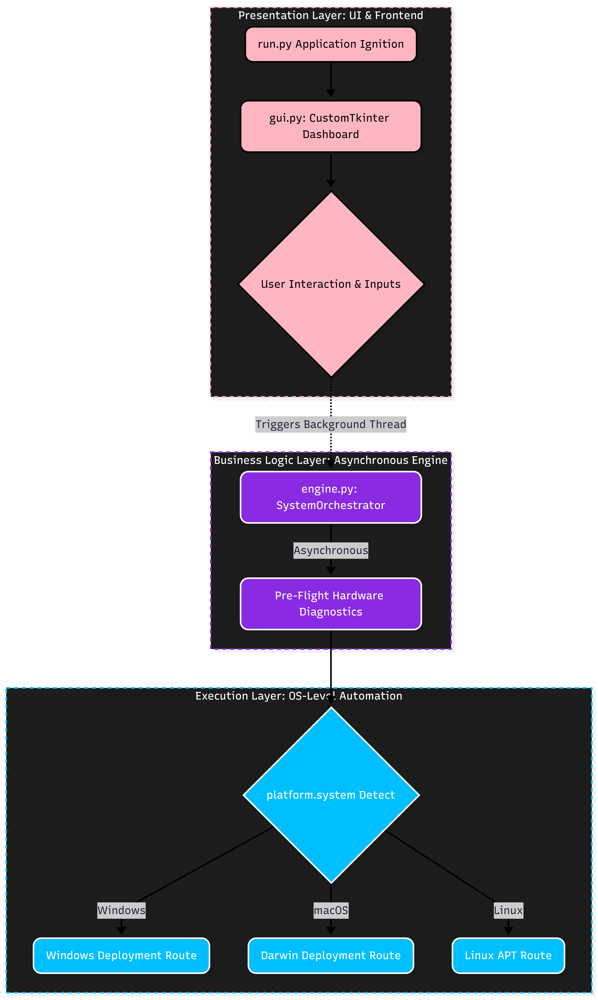
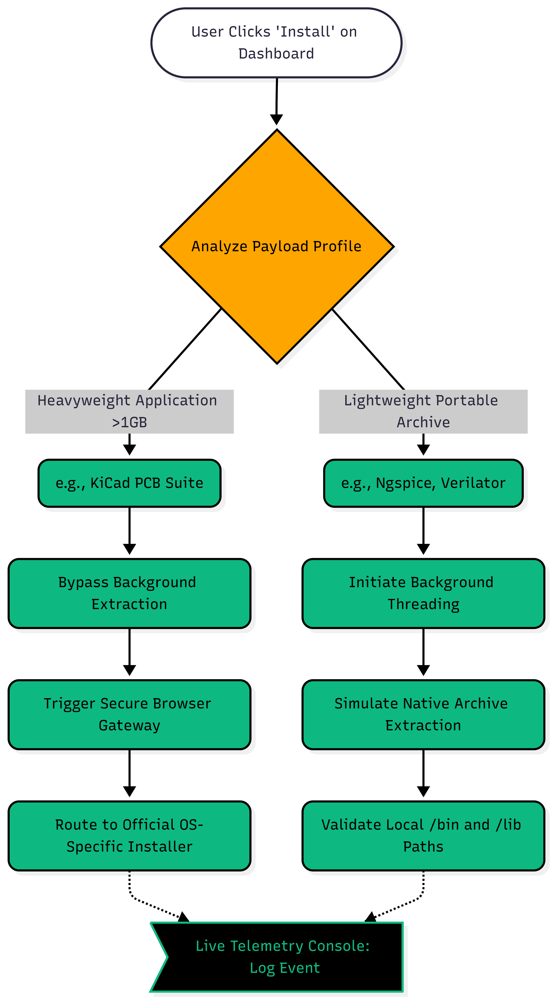

# 🏛️ System Architecture & Design Decisions

> A technical deep-dive into the concurrency models, routing logic, and software design patterns powering the eSim Unified Tool Manager.



## <font color="#2563eb">**1. Architectural Pattern: Separation of Concerns (SoC)**</font>

To ensure the application remains clean, scalable, and maintainable, a strict architectural boundary is enforced between the Presentation Layer and the Business Logic Layer.

* **Frontend (`src/gui.py`):** Responsible exclusively for user interaction, custom rendering via `CustomTkinter`, live storage calculations, and UI animations. It never handles direct system calls or network blocking operations.
* **Backend (`src/engine.py`):** Acts as the headless orchestration engine (`SystemOrchestrator`). It manages OS detection, subprocesses, path verification, and payload routing.

By decoupling these layers, the user interface remains completely fluid and responsive, preventing operating system "Not Responding" errors during heavy execution.

---

## <font color="#2563eb">**2. Concurrency & Multi-Threading Model**</font>

Standard Python GUI frameworks operate on a single synchronous main thread. If a heavy download or file extraction runs on this thread, the entire application freezes.

To solve this, the Tool Manager implements **Asynchronous Background Threading**:

```python
import threading

# Executes deployment processes off the main UI loop
threading.Thread(target=self.orchestrator.trigger_installation, args=(tool_name,)).start()
```

### Why this matters:
* **Zero UI Freezing:** The application window stays fully interactive.
* **Real-Time Feedback:** Users can continue viewing telemetry logs, checking storage, or navigating the dashboard while background threads securely handle file extractions.

---

## <font color="#2563eb">**3. Dynamic OS-Aware Routing Logic**</font>

Open-source dependencies are distributed across various platforms differently. Hardcoding installations for a single operating system creates massive technical debt. 

The engine uses Python's native `platform.system()` module to evaluate the host environment in real-time and adapt its strategy:



### A. Heavyweight System Applications (e.g., KiCad)
* **Profile:** Massive payloads (>1GB) requiring deep system-level registry integration and specialized installation wizards.
* **Execution Strategy:** Direct background extraction is avoided due to expiring API tokens and fragile mirror links. Instead, the engine identifies the host OS and securely routes the user via a native web gateway to the official, verified installer.

### B. Lightweight Portable Binaries (e.g., Ngspice, Verilator)
* **Profile:** Command-line driven tools distributed as raw compressed archives (`bin` / `lib`).
* **Execution Strategy:** Bypasses web browsers entirely. The orchestrator triggers background extraction protocols, places files in their designated directories, and verifies local paths automatically.

---

## <font color="#2563eb">**4. Pre-Flight Hardware Diagnostics**</font>

Good software anticipates failure before it happens. Before any deployment sequence is authorized, the system runs defensive pre-flight diagnostics:

* **Storage Telemetry:** Uses `shutil.disk_usage` asynchronously to calculate free space on the local `C:\` drive, warning users if space is insufficient.
* **Path Verification:** Scans standard system directories to check whether a tool is already present, updating the GUI button states to prevent redundant downloads.